# Appendix 3: Initial Identity and Access Management for a New Account

There are a few security considerations regarding the access to your new AWS account that you may want to address. 

Log in to the **[AWS Console](https://console.aws.amazon.com)**. 

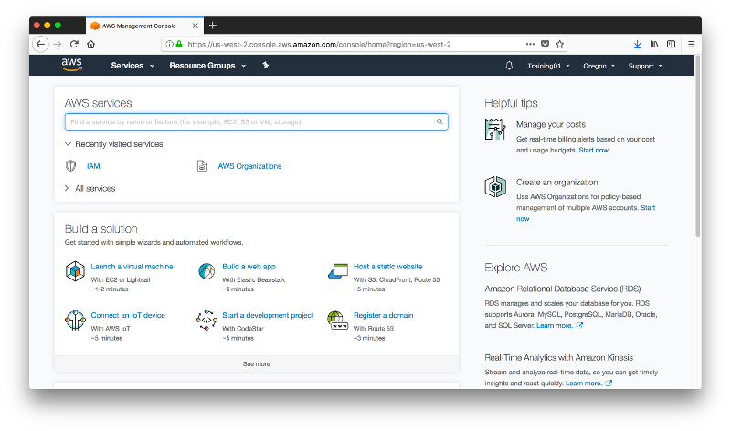

Navigate to **Identity and Access Management**. In the Dashboard you will find a number of warnings that are good practice to take care off.

First, activate Multi-Factor Authentication (MFA) to add an additional level of security. There are just too many bad actors out there and we don’t want to make life simple for them so expand the drop down element and click on **Manage MFA**.

Select a **Virtual MFA** and click on **Next Step**. In order to configure a Virtual MFA we require a device with an application that supports TOTP (Time-Based One-Time Password Algorithm) such as Google Authenticator (for more information see also [Using Multi-Factor Authentication (MFA) in AWS](http://docs.aws.amazon.com/IAM/latest/UserGuide/id_credentials_mfa.html?icmpid=docs_iam_console)).

Confirm the requirements for a Virtual MFA and click on **Next Step**.

Scan the QR Code in your Virtual MFA application (e.g. Google Authenticator) on your mobile device and enter 2 subsequent codes as requested then click **Activate Virtual MFA**.

That completes the activation of the virtual MFA. Click **Finish** to return to the dashboard.

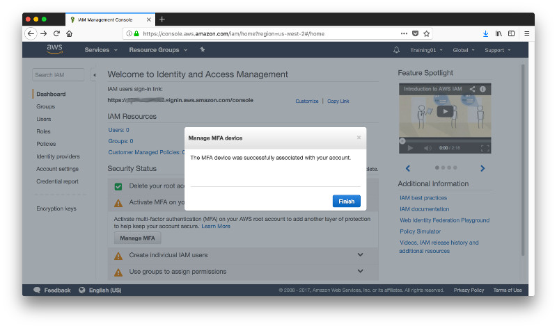

When you first create an AWS account, you begin with a single sign-in identity that has complete access to all AWS services and resources in the account. This identity is called the AWS account *root user* and is accessed by signing in with the email address and password that you used to create the account. It is strongly recommended to create IAM (Identity and Access Management) users - even for administrative tasks and use the root user only for a [limited set of tasks that require these elevated priviliges](http://docs.aws.amazon.com/general/latest/gr/aws_tasks-that-require-root.html). 
So go ahead and expand the drop down **Create individual IAM users** and click on **Manage Users**.

Click on **Add User**

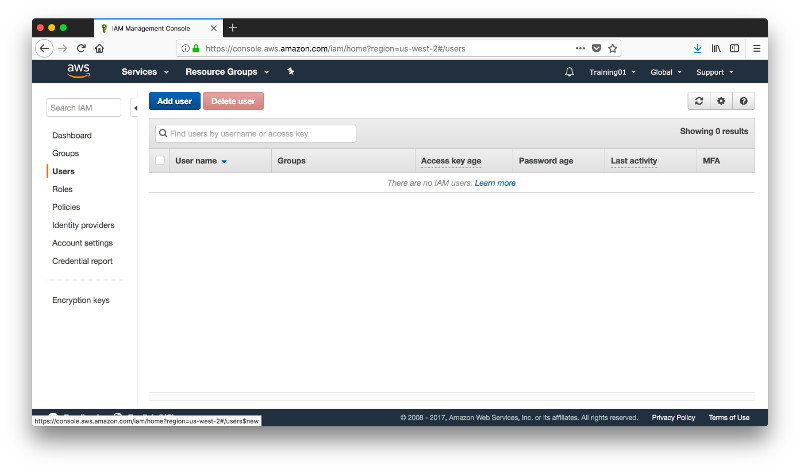

Give the user a name and check the boxes for **Programmatic Access** and **Console Access**. The former is required for the AWS Command Line Interface (CLI) and Software Development Kits (SDK). Also give the user a password. Leave the require password reset unchecked since this user is for yourself and then click **Next Permissions**.

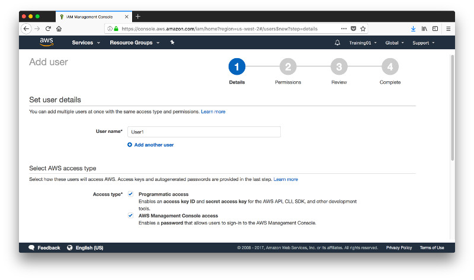

Select **Add user to group** and click on **Create Group**.

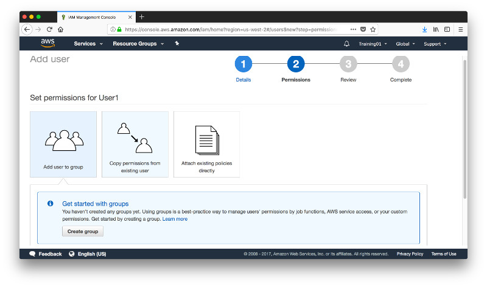

Give the group a name (here Admin) and tick the box next to **AdministratorAccess**. This is our first IAM user and we want to give it full admin rights.

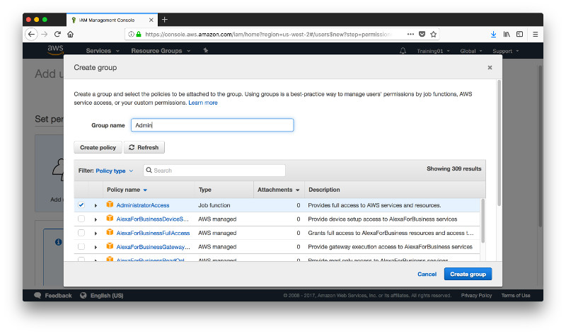

Click on **Next Review**...

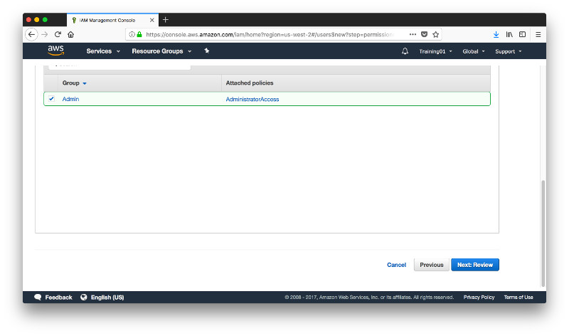

...and in the following screen on **Create User**.

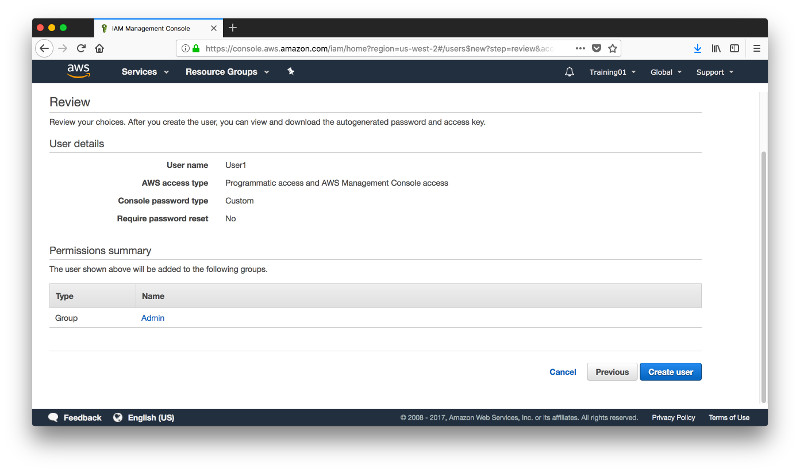

Acknowledge the confirmation that the user has been created and click on **Close**.

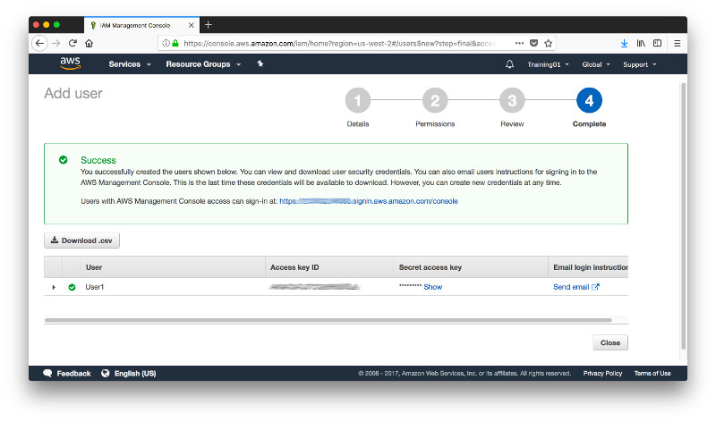

Back in the Dashboard you will see that the warnings for IAM users and groups have been resolved and only the password policy remains. Expand the dropdown **Apply an IAM password policy** and click on **Manage Password Policy**.

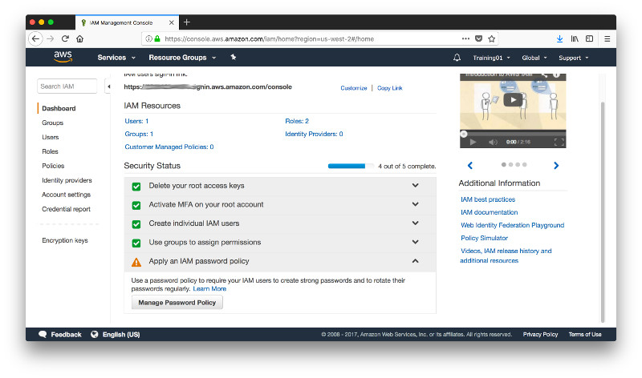

Set the password policy as you see fit. Here you see a minimum password length of 6 characters, requirements for upper and lower case characters, numbers as well as alphanumeric characters and you also allow the users to change their passwords. Then cick on **Apply password policy**.

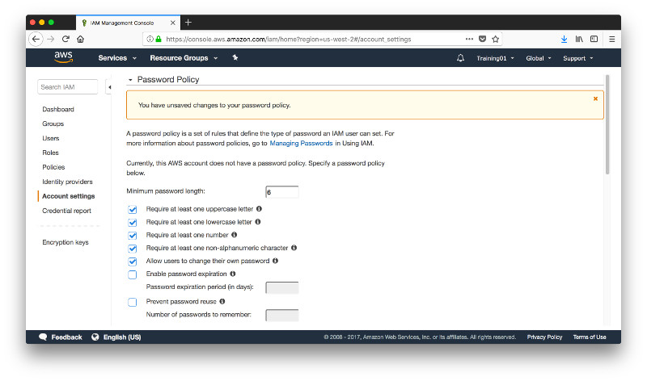

Back in the dashboard you see that all warnings are now resolved. So you can log out as the root user and log back in as the newly created IAM user. 

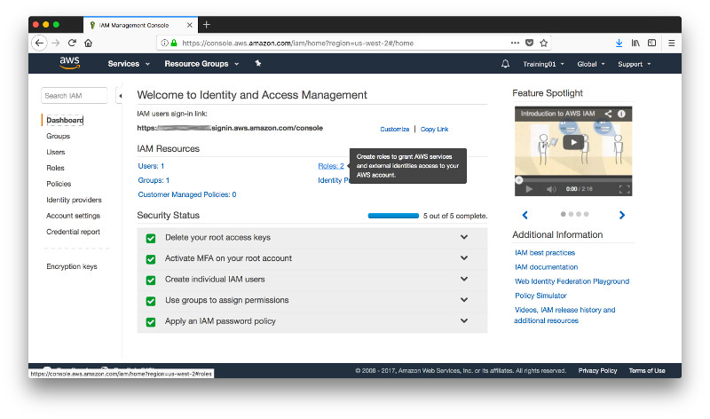

For the root user you have already enabled MFA but you haven't done the same yet for the IAM user so head over to the IAM console.

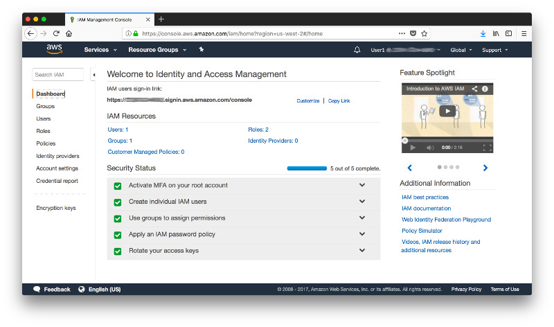

Select your user and navigate to the tab **Security credentials**, then click the pencil next to **Assigned MFA device** which currently shows **No**.

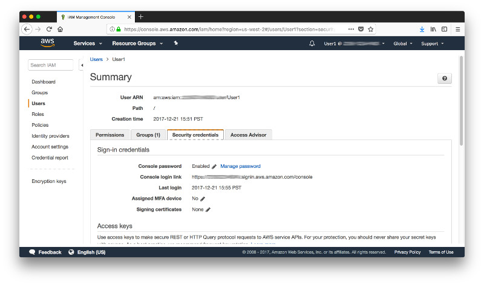

The next steps are the same as the ones for the root user. Select **A virtual MFA device** and click on **Next Step**. 

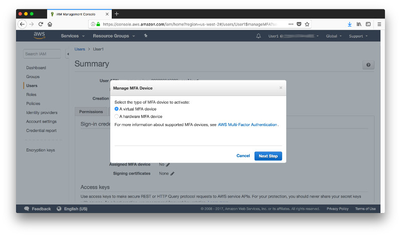

Acknowledge the reminder that you require an MFA application  such as Google Authenticator and click on **Next Step**.

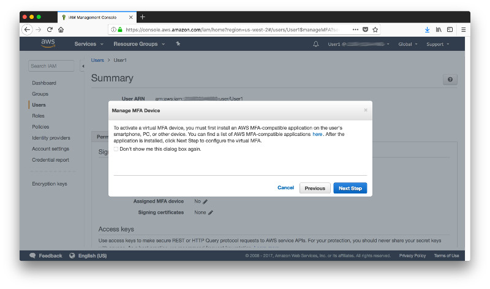

Scen the QR Code in your virtual MFA device and enter 2 subsequent authentication codes, then click on **Activate Virtual MFA**.

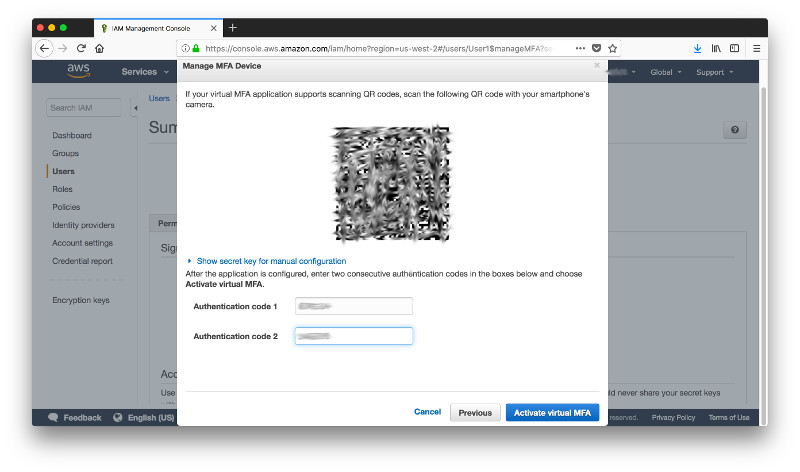

Back in the screen for the configuration of security credentials for your IAM users scroll down and click on create **Create access key**. This is the key you will require for CLI and SDK access to your AWS account.

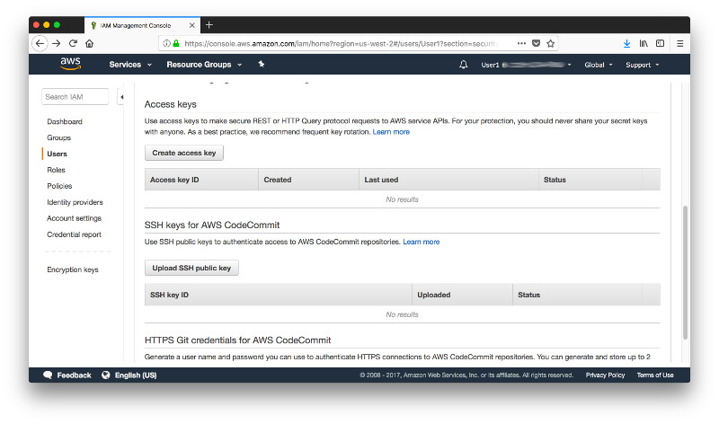

This is the only time you will see the **secret access key** in the concole. You can delete it and create a new one but once you leave this screen you can never again retrieve the key from the console. So, copy the secret access key and store it somewhere save or simply download the credentials as .csv file. 

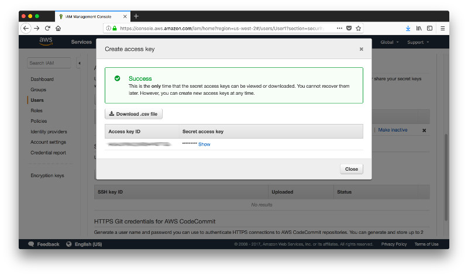

This concludes the initial configuration of the Identity and Access Management for you new account and you're all set for the next steps.