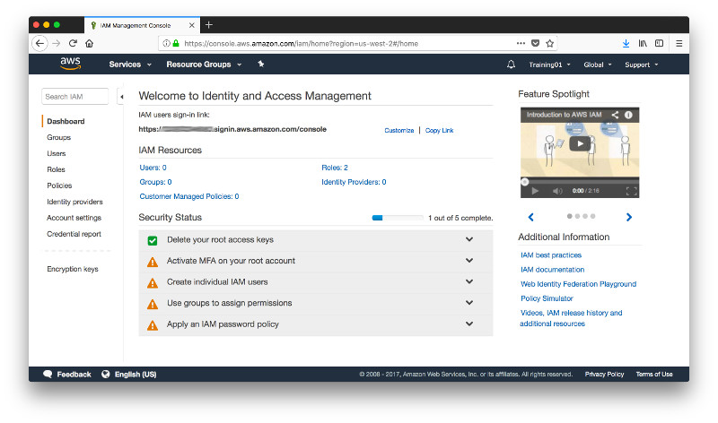
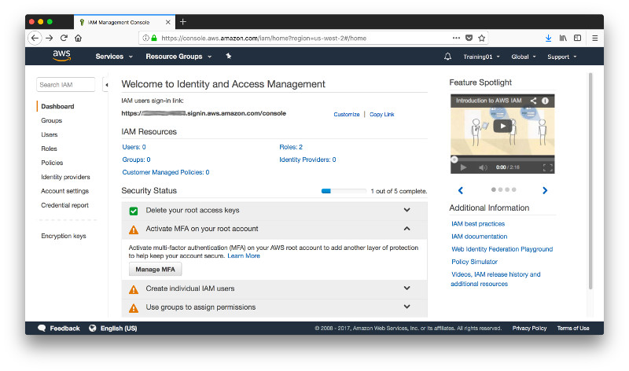
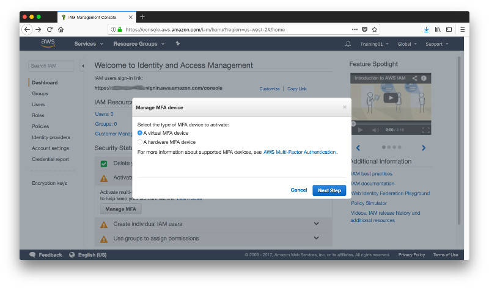
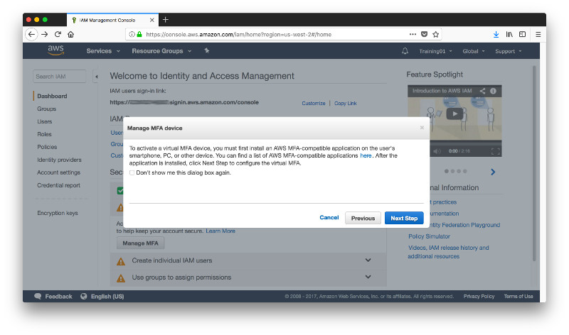
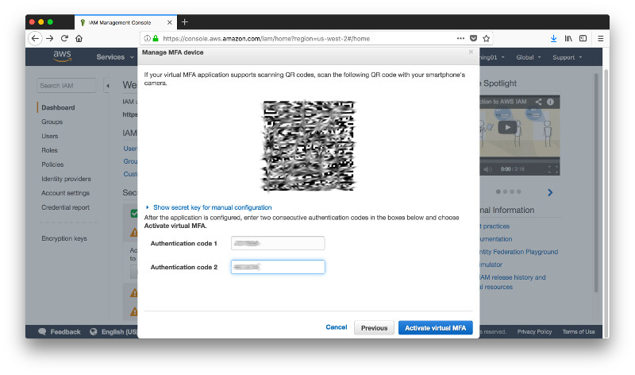
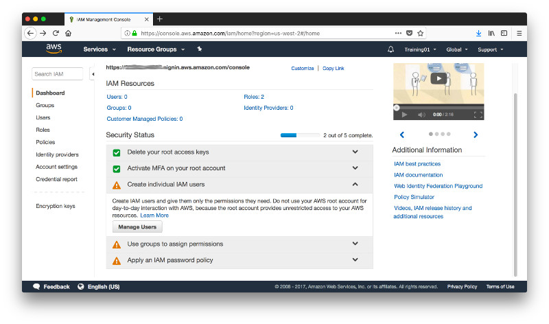

# Appendix 3: Initial Identity and Access Management for a New Account

There are a few security considerations regarding the access to your new AWS account that you may want to address. 

Log in to the **[AWS Console](https://console.aws.amazon.com)**. 

Navigate to **Identity and Access Management**. In the Dashboard you will find a number of warnings that are good practice to take care off.

First, activate Multi-Factor Authentication (MFA) to add an additional level of security. There are just too many bad actors out there and we don’t want to make life simple for them so expand the drop down element and click on **Manage MFA**.

Select a **Virtual MFA** and click on **Next Step**. In order to configure a Virtual MFA we require a device with an application that supports TOTP (Time-Based One-Time Password Algorithm) such as Google Authenticator (for more information see also [Using Multi-Factor Authentication (MFA) in AWS](http://docs.aws.amazon.com/IAM/latest/UserGuide/id_credentials_mfa.html?icmpid=docs_iam_console)).

Confirm the requirements for a Virtual MFA and click on **Next Step**.

Scan the QR Code in your Virtual MFA application (e.g. Google Authenticator) on your mobile device and enter 2 subsequent codes as requested then click **Activate Virtual MFA**.

That completes the activation of the virtual MFA. Click **Finish** to return to the dashboard.

When you first create an Amazon Web Services (AWS) account, you begin with a single sign-in identity that has complete access to all AWS services and resources in the account. This identity is called the AWS account *root user* and is accessed by signing in with the email address and password that you used to create the account. It is strongly recommended to create IAM (Identity and Access Management) users - even for administrative tasks and use the root user only for a [limited set of tasks that require these elevated priviliges](http://docs.aws.amazon.com/general/latest/gr/aws_tasks-that-require-root.html). 
So go ahead and expand the drop down **Create individual IAM users** and click on **Manage Users**.

