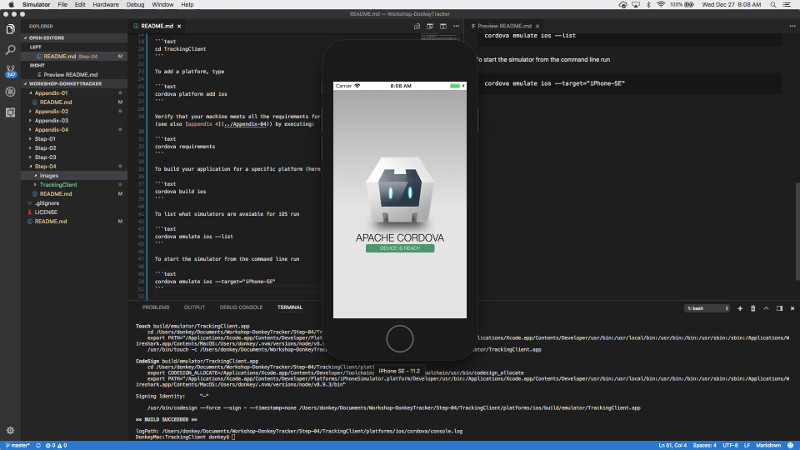

# Step 4: The Mobile Device Application

Let's first verify that everything works as expected by building and simulating the **Get Started** Cordova application:

> Tip: If you are using [Visual Studio Code](https://code.visualstudio.com/) as your code editor you may have already noticed that it has a build in terminal. This is quite useful when you have to develop both from the command line and the code editor since you don't need to switch between windows.



Create a blank Cordova project using the command line tool. Navigate to the directory where you wish to create your project and type

```text
cordova create TrackingClient net.talkingdonkey.trackingclient TrackingClient
```

For a complete set of options, type cordova help create. 

After creating a Cordova project, navigate to the project directory. F

```text
cd TrackingClient
```

To add a platform, type

```text
cordova platform add ios
```

Verify that your machine meets all the requirements for developing Apache Cordova apps (see also [appendix 4](../Appendix-04)) by executing:

```text
cordova requirements
```

To build your application for a specific platform (here iOS) enter

```text
cordova build ios
```

To list what simulators are avaiable for iOS run

```text
cordova emulate ios --list
```

To start the simulator from the command line run

```text
cordova emulate ios --target="iPhone-SE"
```
