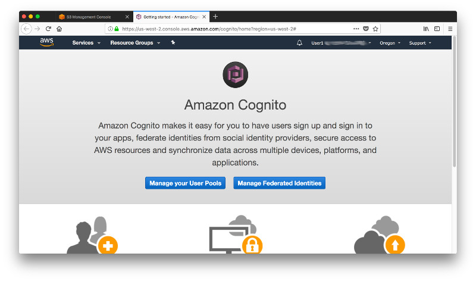
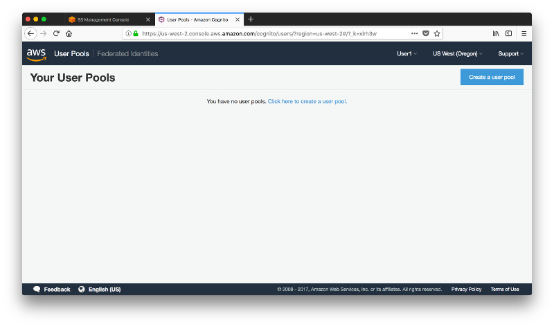
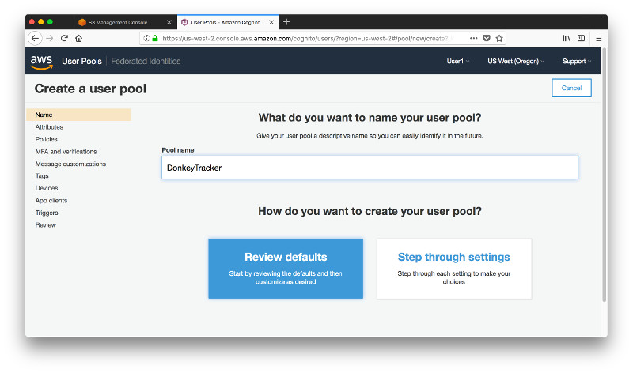
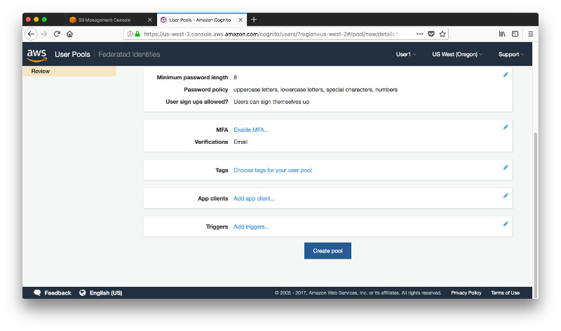
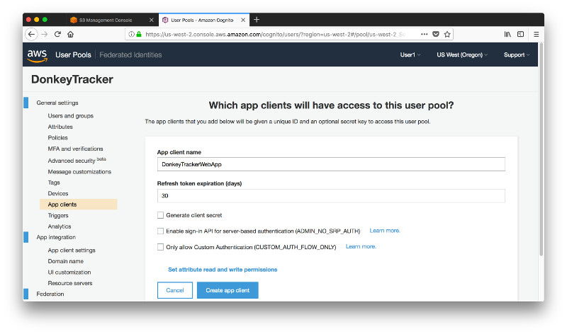

# Step 7: User Management with Cognito

Log in to the **[AWS Console](https://console.aws.amazon.com)**, navigate to **Cognito** and click on **Manage your User Pools**.

Click on **Create a user pool**,...

...give the user pool a name (here: DonkeyTracker) and click on **Review defaults**.

The defaults are fine for our purposes, they require an email confirmation for new user sign-ups and a minimum of user information. Scroll down and click on **Create Pool**.

Take note of the **Pool Id**, you will need this for the configuration of your website and then click on **App Clients** in the navigation tree to the left.

Click on **Add an app client**. This will be a unique ID for the app or website that we want to grant the user pool access to and will also be configured in your website.

Give the app client a name (here: DonkeyTrackerWebApp) and uncheck the box **Generate Client Secret**. Then click on **Create app client**.

Take note of the **App client id**. You will configure it in your website in the next step.

And that's it already for the Cognito configuration. That was very simple and straight forward, wasn't it? You're now ready to apply the configuration to your website, so head over to [step 8](../Step-08).