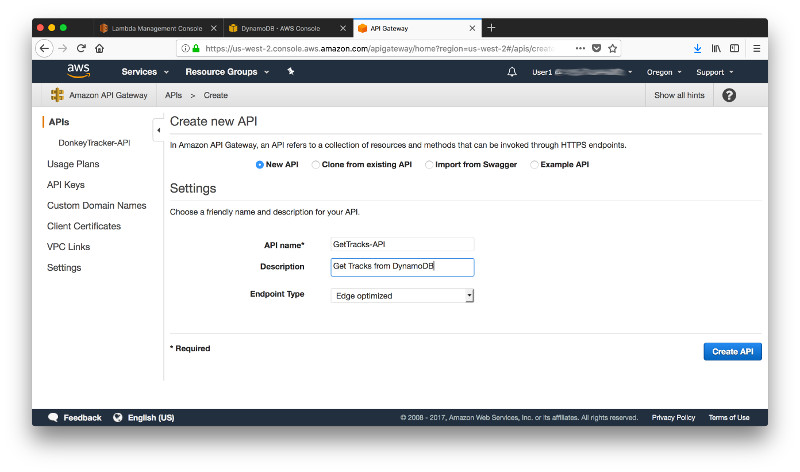
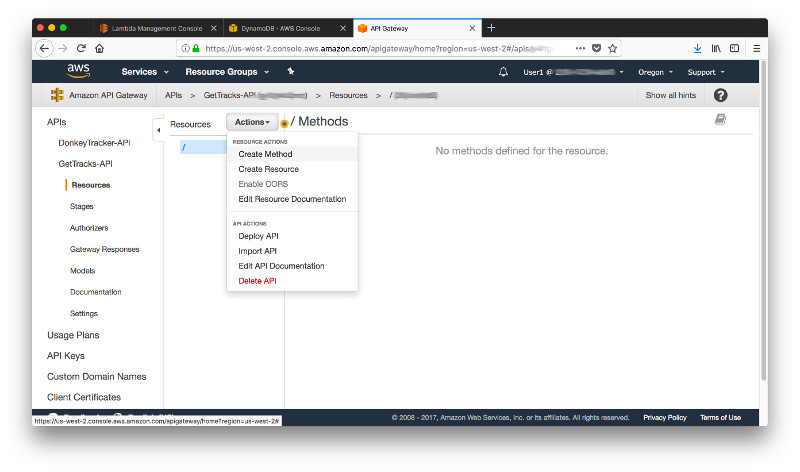
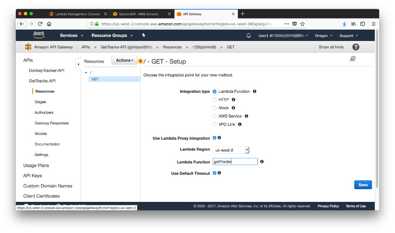
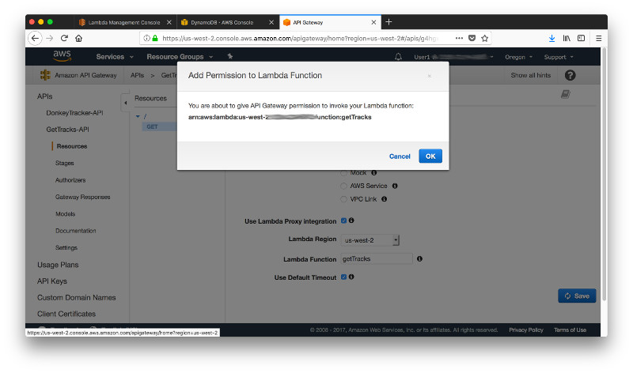
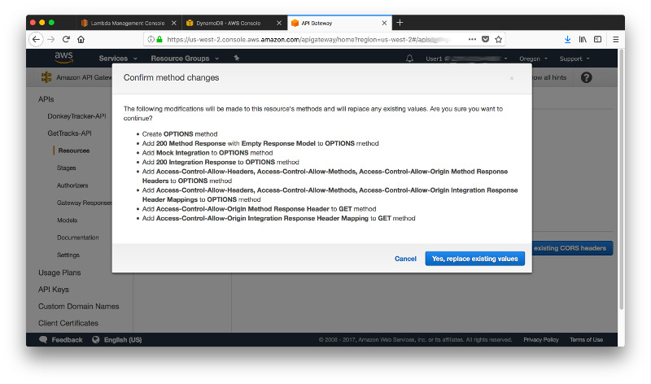
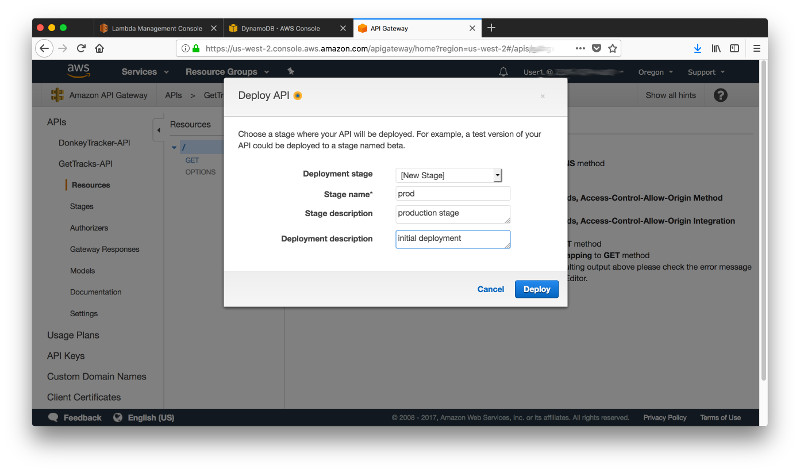
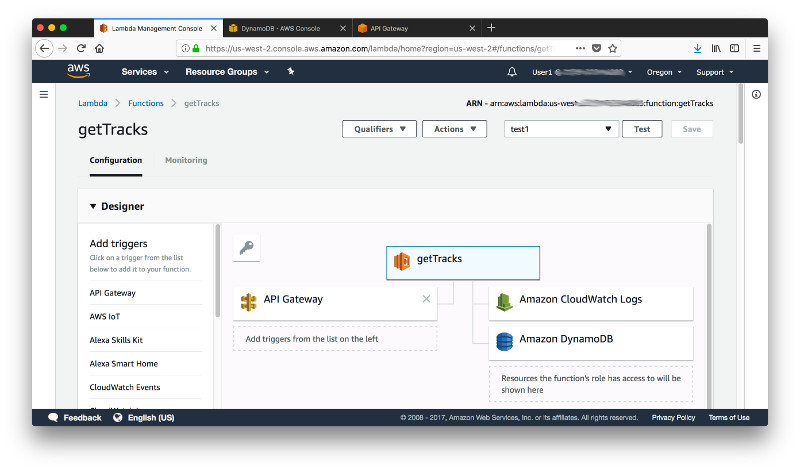
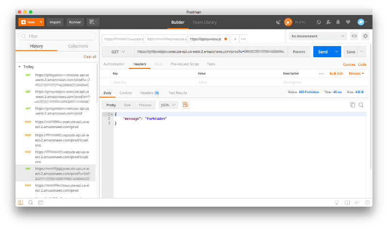
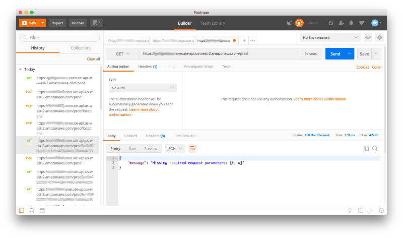

# Step 9: Create an API for your Website

Log in to the **[AWS Console](https://console.aws.amazon.com)**, navigate to **Lambda**, make sure you are in the same region as where you deployed your previous Lambda function, the API Gateway and the DynamoDB and click on **Create function**.


Pick the **Author from scratch** option, give the function a name (here: getTracks) and keep the default runtime as Node.js.


Pick the same IAM role that you created in step 2 and click on **Create function**.


Paste the following code in the inline editor. This function retrieves 2 URL parameters from a request that you will pass through the API Gateway - a unique user id and a date - and then query the DynamoDB table with these parameters. There are 2 things worth calling out:

* since we are calling the Lambda function using JavaScript from a website that lives in a different domain we must enable CORS by setting **Access-Control-Allow-Origin**
* DynamoDB has a whole bunch of [Reserved Words](https://docs.aws.amazon.com/amazondynamodb/latest/developerguide/ReservedWords.html) and 2 of them overlap with the properties of the JSON objects you send to the database. In order to resolve these conflicts, you can use [Expression Attribute Names](https://docs.aws.amazon.com/amazondynamodb/latest/developerguide/Expressions.ExpressionAttributeNames.html).

```javascript
var AWS = require("aws-sdk");

AWS.config.update({
    region: "us-west-2",
    endpoint: "https://dynamodb.us-west-2.amazonaws.com"
});

var docClient = new AWS.DynamoDB.DocumentClient();

exports.handler = (event, context, callback) => {
    const done = (err, res) => callback(null, {
        statusCode: err ? '400' : '200',
        body: err ? err.message : JSON.stringify(res),
        headers: {
            'Content-Type': 'application/json',
            'Access-Control-Allow-Origin': '*'
        },
    });
  
    var params = {
      ExpressionAttributeNames:{
        "#u": "uuid",
        "#t": "timestamp"
      },
      ExpressionAttributeValues: {
        ':u': event.queryStringParameters.u,
        ':t' : event.queryStringParameters.t
       },
     KeyConditionExpression: '#u = :u and begins_with(#t, :t)',
     ProjectionExpression: '#t, latitude, longitude, speed',
     TableName: 'Tracks'
    };
    
    docClient.query(params, done);
};
```


Now create a new test event to simulate the HTTP GET request that will be passed through the API Gateway. You can describe URL-parameters as shown below. For the test pick one of the UUID's you already have in the DynamoDB table from the previous tests, make sure to pick a date for which you have data and describe it in the format YYYY-MM-DD.

```json
{
  "httpMethod": "GET",
  "queryStringParameters": {
    "u": "YOUR UUID",
    "t": "2017-12-31"
  }
}
```


Now test your function with the newly created test events and verify that you get a number of items with latitude, longitude, speed and timestamp back.


With the Lambda function in place, you can now create a new API. Because the API you created in step 3 only uses a HTTP POST method, you could theoretically use this API and create an additional GET method but since you may want to use different credentials or set different usage plans you may want to create a new API. So, click on the button **Create API**.


Make it a **New API**, give the API a **name** (here: getTracks) and click on **Create API**.



Once the API is created pick **Create Method** from the **Actions** menu.



Select **GET** as the method and click on the checkmark.


Leave the default **Lambda Function** as **Integration type**, tick the box **Use Lambda Proxy integration**, pick the region where you deployed your Lambda functions and then the function you created in the previous step before you click on **Save**.



Acknowledge the warning that you are about to give the API Gateway access to a Lambda function by clicking on **OK**.



Once the method is created click on **Method Request** for further configuration.


Set the **API Key Required** to **true** and the **Request validator** to **Validate query string parameters**. Then add 2 new **URL Query String Parameters** – **t** for the timestamp and **u** for uuid - and make them **Required**.


Next, we want to **Enable CORS**. So, go ahead and pick that option from the **Actions** menu. 


Accept the defaults and click on **Enable CORS and replace the existing CORS headers**


Acknowledge the summary of changes that are about to be made by clicking on **Yes, replace existing values**.



You are ready to **Deploy** the API. So, pick tht option from the **Actions** menu next.


Pick **[New Stage]**, give that stage a name (here: prod) and click on **Deploy**.



Take note of the **Invoke URL**. You will use it shortly in your tests and in the next step for your website configuration.


You have configured the API to require an API key but the one you created in step 3 is currently only configured for the DonkeyTracker-API. You can either create a new usage plan and key for this API or modify the existing key to work with the new API as well. Let's do the latter. Choose **Usage Plans** on the left-hand navigation tree and pick the usage plan you created in step 3. Under **Details** click on **Add API Stage**, add the new API and stage and click on the checkmark.


Once the changes are applied...


...head over to the Lambda console and verify in the **Designer** that the API Gateway is indeed now a trigger that can onvoke your new function.



Finally, it's time for some tests. Use Postman or a similar tool to craft some sample requests to verify that the calls you want to permit work and those you don't want to allow, don't. 

Create a call that doesn't use the API key in the header. The call should be rejected.



Now add **x-api-key** and a valid key to the header but omit the URL parameters. This should be rejected by the **Request Validator**.



Finally create a valid call with URL paramateres for which you have data and you should see a list of items coming back.


With the API in place, you are now eady to move to [step 10](../Step-10) and connect the API to your website.