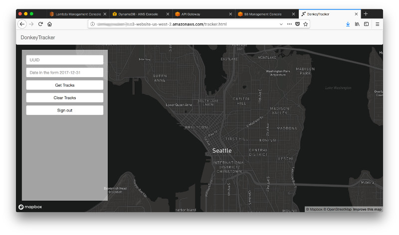

# Step 10: Connecting your Website to your New API

The code for your website is already prepared to call your newly created API (to review the code click [here](../Step-08/Website/j/tracker.js)) but you still need to make a modification to config.js to provide the Invoke URL for your API Gateway and a key. To do so, navigate to the **S3 Console** and to the folder **js** in the bucket you use for your website. Download the file **config.js** and replace **YOUR_INVOKE_URL** and **YOUR_API_KEY** with the correct values for your environment. The other placeholders should already have been replaced in prior steps.

```javascript
window._config = {
    cognito: {
        userPoolId: 'YOUR_USER_POOL_ID', 
        userPoolAppClientId: 'YOUR_APP_CLIENT_ID', 
        region: 'YOUR_AWS_REGION'
    },
    mapbox: {
        token: 'YOUR_MAPBOX_TOKEN'
    },
    api: {
        invokeUrl: 'YOUR_INVOKE_URL',
        key: 'YOUR_API_KEY'
    }
};
```

Once you made the changes, upload the modified config.js to your S3 bucket and navigate to http://[your-website-url]/tracker.html in your browser.



Enter a valid UUID, i.e. one that you have in the DynamoDB table from previous tests, and a date for which you have data in the format YYYY-MM-DD and click on **Get Tracks** to see the data.


You have now an end-to-end serverless application with a mobile application, a website user management and a couple of APIs in place. The next steps are optional but advisable for real-world applications and include taking advantage of a content delivery network, registering your own custom domain and securing the data in transit through SSL. Do you want to go the extra steps? Great, head over to [step 11](./Step-11) to bring your website to the edge with **CloudFront**.
