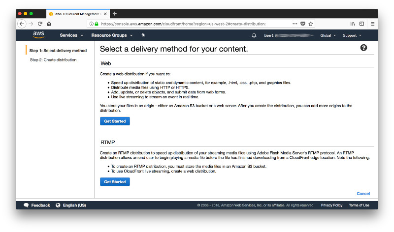
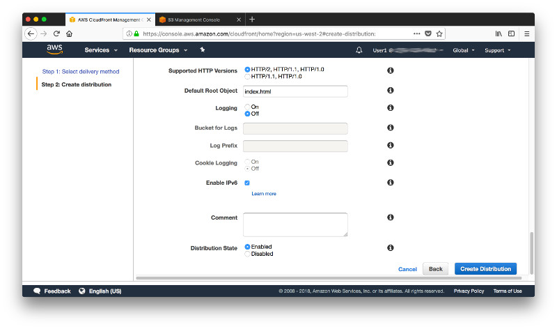
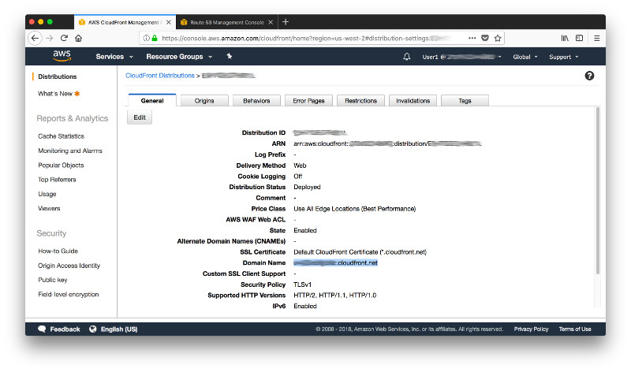

# Step 11 (optional): Going to the Edge with CloudFront

Log in to the **[AWS Console](https://console.aws.amazon.com)**, navigate to **CloudFront** and click on **Create Distribution**.

Click on **Get Started** in the section **Web** distribution.

While the **Origin Domain Name** in the following screen provides a number of options - including the S3 bucket we have created - we are not taking this option, since it points to the REST endpoint as opposed to the website URL whch we will need. If you have forgotten the website URL you can always get it back by navigating to the **S3 Console** and looking at the Properties for the **Static website hosting** of your bucket. 

Back in the CloudFront Console enter this URL in the form of http://[YOUR_BUCKET_NAME].s3-website-[YOUR_REGION].amazonaws.com as the **Origin Domain Name**.

Activate the radio box to **Compress** objects further down on the page,...

...set the **Default Root Object** to **index.html** and  click on **Create Distribution**.

It will take a few minutes to create and globally deploy the new CloudFront Distribution and during this time the status will show as **In Progress**.

Once the deployment is complete, click on the distribution...

 ...to see the details - including the **Domain Name**. Copy the domain name and navigate to it in a new browser tab.

You should see the home page of your website.

Configuring your website to take advantage of the global network of edge locations, the performance and the protection that CloudFront can provide was simple enough but your domain name still looks more like Amazon than yours. In the next 2 optional steps you will register your own domain and create a re-direct to cater for a domain name with and without the **www**-prefix. Head over to [step 12](../Step-12) to register your domain with **Route 53** and point it to your CloudFront distribution.