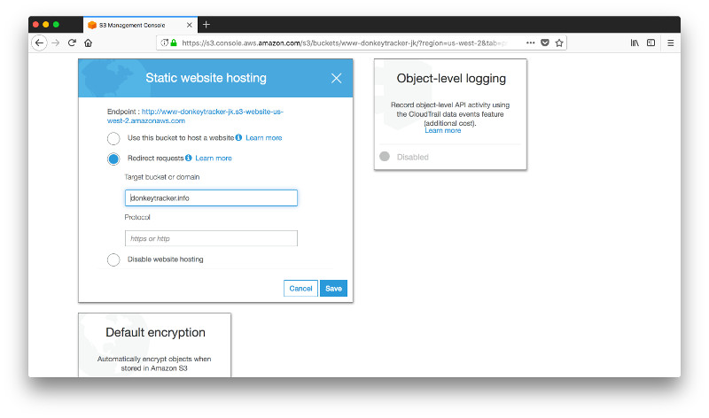
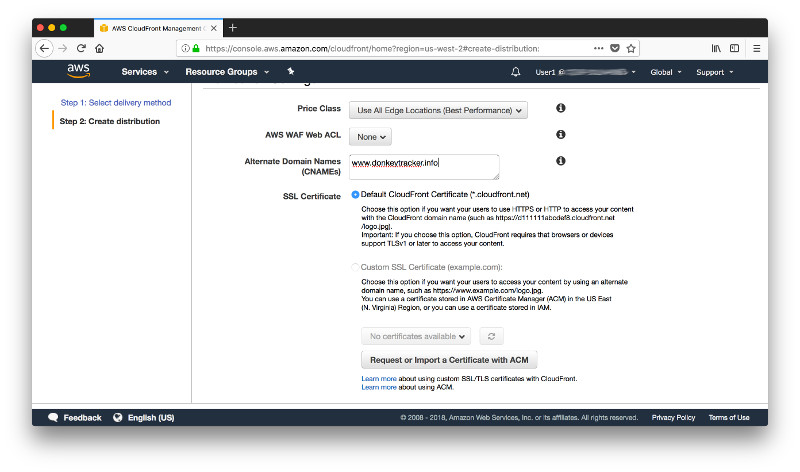
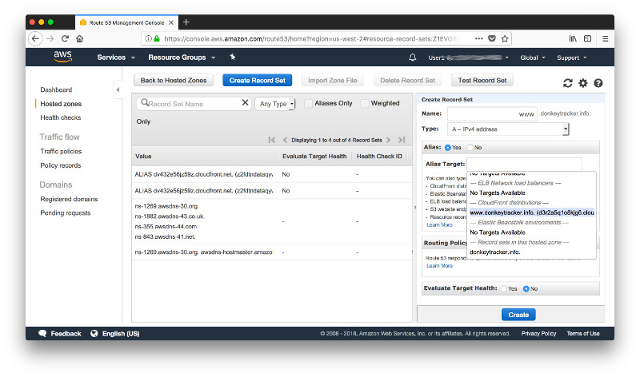

# Step 13 (optional): WWW Domain Redirect

To create a re-direct from a request that uses your domain name with the prefix **www** to your naked domain name, you can take advantage of the re-direct feature in S3. Since you are already distributing your website through a CDN worldwide, you would also want to create a 2nd CloudFront distribution. By now you have some experience with the services we are using here, so we can shorten the description.

Log in to the **[AWS Console](https://console.aws.amazon.com)**, navigate to **S3** and click on **Create bucket**. Give the bucket a unique name and click on **Create**.

Now navigate to the bucket, click on the tab **Properties** and then the card **Static website hosting**. Instead of using the option to host a website as you did in step 6, you choose now the option **Redirect request** and enter the naked domain name in the text box before clicking on **Save**. Make sure to take note of the endpoint URL. You will need it in the next step.

Navigate to the **CloudFront** Console and create a new web distribution pointing at the endpoint of your newly created S3 bucket in the form **http://[YOUR_SECOND_S3_BUCKET].s3-website-[YOUR_REGION].amazonaws.com**.

Scroll down to the **Alternate Domain Names** and enter your domain name with **www** prefix before clicking on **Create Distribution**.

Next navigate to the **Route 53** Console and create records for the IP v4 and IP v6 addresses of your domain with **www** prefix.

In both cases use **www** as **Name**, choose **Type A** for IP v4, activate the radio box **Alias Yes** and pick the newly created CloudFront distribution as **Alias Target**.

Repeat the same for the IP v6 record with the only difference that you choose now **AAAA** as the **Record Type**.

Finally, test the redirect by entering www.[YOUR DOMAIN NAME] into the browser. 

You are almost there, the last step is to secure data in transit by enabling SSL support. You will do that in [step 14](../Step-14).