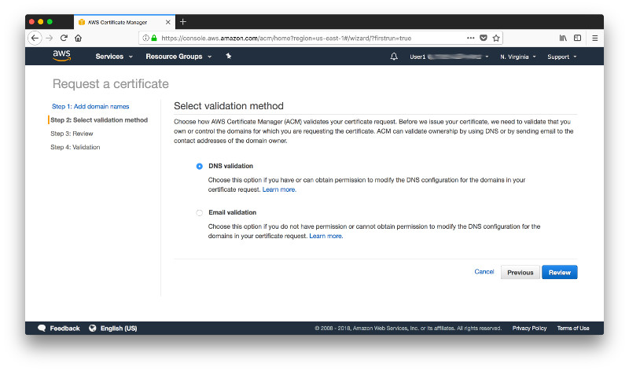
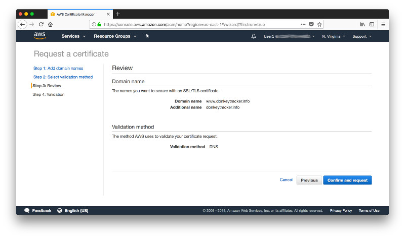
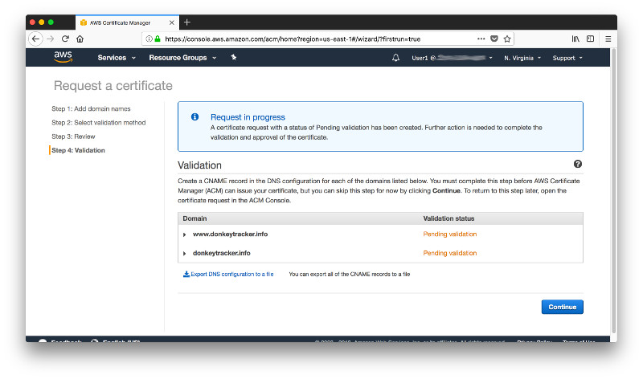
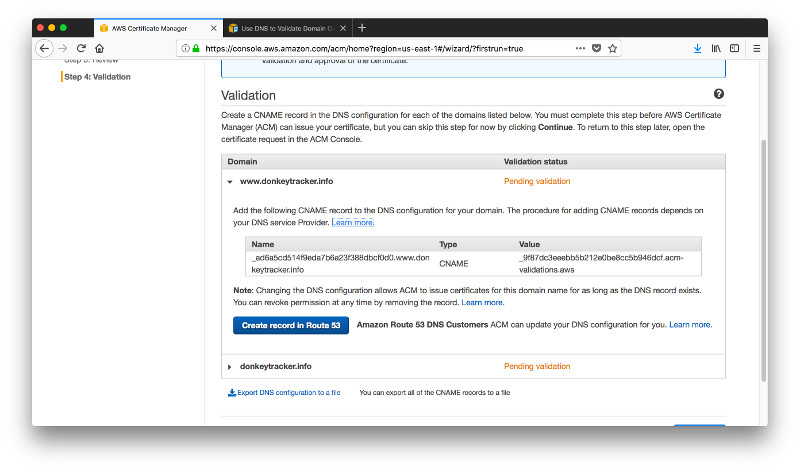
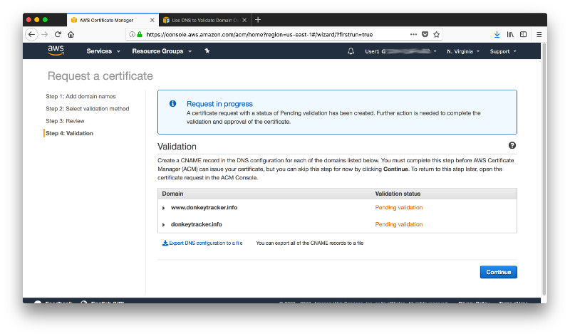
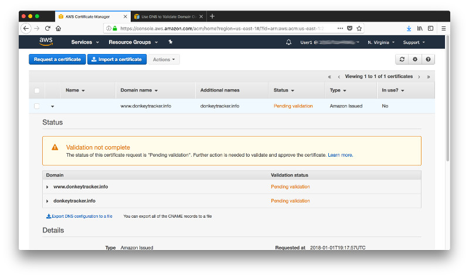
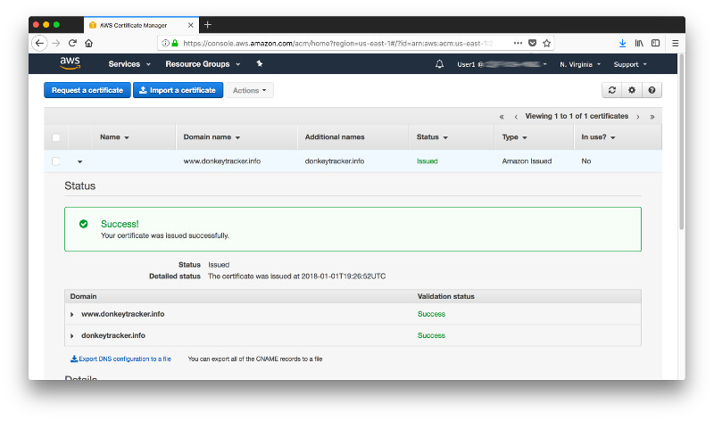
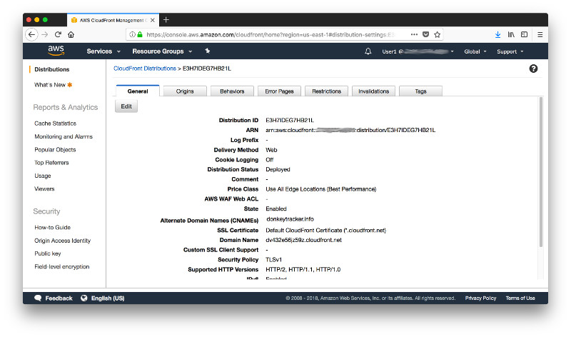
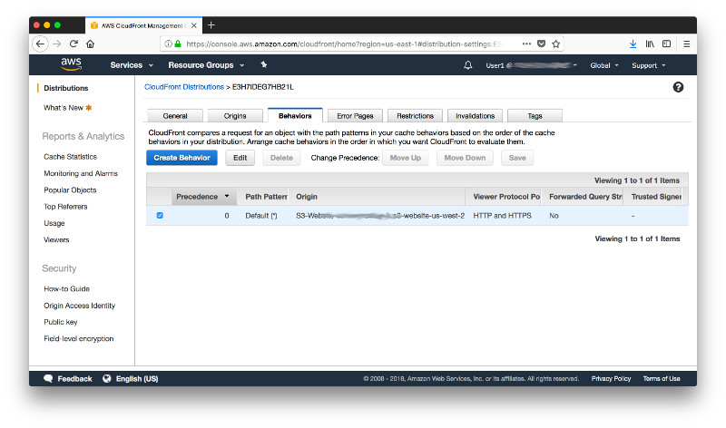
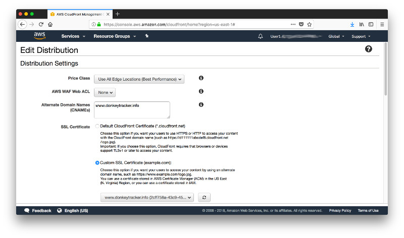

# Step 14 (optional): Adding SSL Support

Log in to the **[AWS Console](https://console.aws.amazon.com)**, navigate to **Certificate manager** and click on **Get Started**.

> **Important:** For the certificate to work with CloudFront, it has to be created in the us-east-1 region (N. Virginia) (see also: [Supported Regions](https://docs.aws.amazon.com/acm/latest/userguide/acm-regions.html)). So, make sure that that region is selected in the top right of your AWS Console.

Enter your naked domain name in the text box, click on **Add another name to this certificate** and enter the domain name with **www** prefix before clicking on **Next**.

You are offered the choice to validate that you are the owner of the domains for which you request the certficate through DNS or Email. DNS validation involves the creation of CNAMEs and if you use Route 53 as your DNS you can easily create these CNAMES right from the Certificate Manager. So, let's choose that option and click on **Review**.

Verify that everything is correct and click on **Confirm and request**.

You will see that the certificate request is **Pending validation**. As mentioned before, you will need to create a CNAME for the naked and one for the prefixed domain name in Route 53. To do that, click on the triangle next to each of the domains.

In the details you will find the CNAME record that is about to be created and you can simply click on **Create record in Route 53** to make the change.

Acknowledge the dialog that confirms once again the change and click on **Create**. Then repeat the same for the 2nd domain.

It takes a few moments for the DNS validation to complete but you can meanwhile click on **Continue**. 

While the certificate is still **pending validation**, head over to the Route 53 Console...

...and verify that the CNAMEs have indeed been created. 

After a few moments the DNS validation is complete and the certificate is issued. You can now configure it in your CloudFront distributions.

Navigate to the CloudFront Console, pick the one you created first and click on **Edit** under the tab **General**.

Activate the radio box for **Custom SSL Certificate** and pick your newly created certificate from the dropdown list.

Scroll down and click on **Yes, Edit**.

Now, switch to the tab **Behaviors** and click on **Edit**.

Activate **Redirect HTTP to HTTPS** in the **Viewer Protocol Policy** to enforce encryption in transit.

Scroll down and confirm your choice by clicking on **Yes, Edit**.

For the 2nd distribution also activate your **Custom SSL Certificate** but since you are already re-directing the traffic, you don't need to change the **Viewer Protocol Policy** and cause a potentially 2nd re-direct.

The S3 bucket that you created to implement a re-direct from the domain with **www** prefix to the naked domain is currently re-directing to the HTTP endpoint and would cause a 2nd re-direct to the SSL endpoint. To avoid this 2nd hop, navigate to the S3 Console and open the **Static website hosting** property for that bucket. Enter **https** as the **Protocol** and click on **Save**.

And that is it. Navigte to your website and verify that you are being redirected to the version with SSL certficate.

